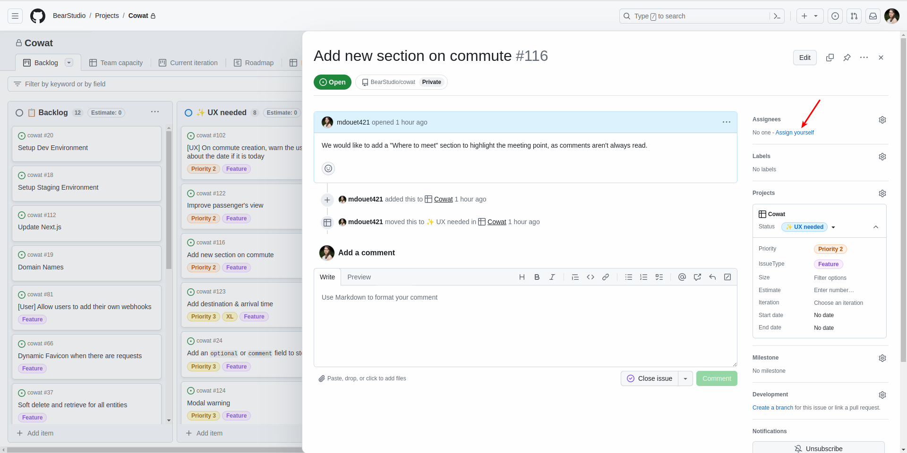
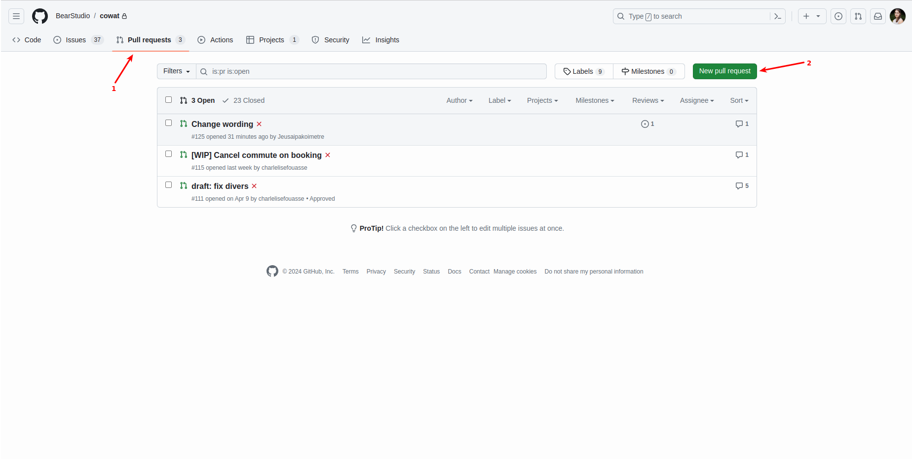
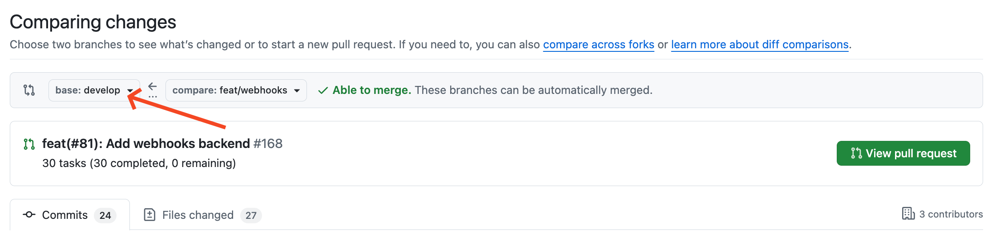
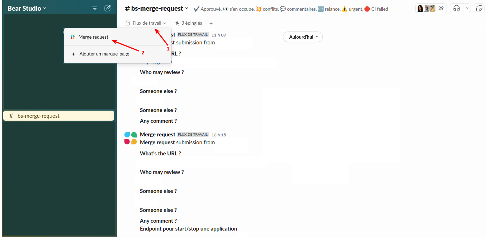
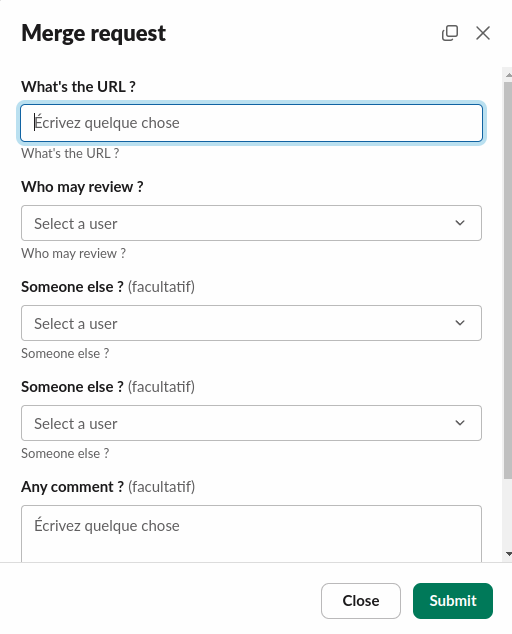

# Create an issue

Every new issue must be written in English and added to the project board in the appropriate column (Backlog - UX Needed - To do).

# Handle a issue

1. Before you start working on an issue, **assign yourself to it**, to avoid having several people working on the same issue.

2. **Move the issue around the board** as you go along. It's important to keep the board up to date, so you can assess the status of your project at a glance. To do this, simply drag & drop the issue into the column you want.
3. Work on a **new branch** for each issue, put consistent messages for your commits and **tag the issue number on each commit**. The branch should be named `fix/xxx-xxx` or `feat/xxx-xxx`, with xxx-xxx being a short description of the issue.
Remember, by convention, issues, branches, PR messages and commits must be written in English.
4. When you've finished working on your issue, move it to the "To review" column. Then **create a PR**, making sure that the reference branch is the "develop" branch.

Make a **review request** in #bs-merge-request on slack, by filling in the URL of the PR and mentioning the people who will be doing the review.

5. **Watch for reactions in the thread** for this review request, correct comments when there are any. If no one responds after several days, contact the reviewer again about the request. When the PR is approved, you can merge the PR.

# Rebase a branch

1. `git pull` : This is extremely important before rebasing ! Otherwise you risk overwriting all the changes that have been made to your branch by someone else and that you wouldn't have pulled
2. `git fetch` : To update with remote branches
3. `git pull origin xxx --rebase` : Replace xxx with the branch you want your rebase to be based on (often `develop` or `main`).
4. For conflicts that have to be resolved manually : `git rebase --continue` to move on to the next step
5. If you wish to cancel the rebase completely and return to the initial state of the branch : `git rebase --abort`
6. `git push --force-with-lease` : Push force is compulsory after a rebase, but with lease lets you know if someone has pushed your branch in-between.